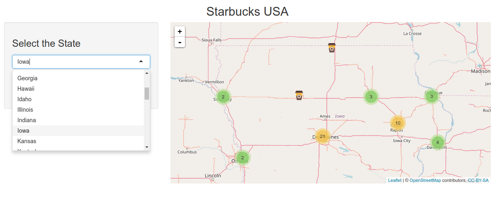
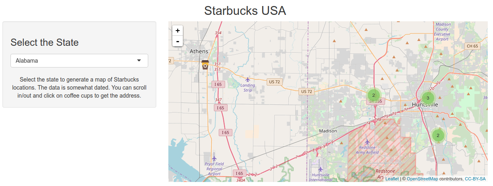
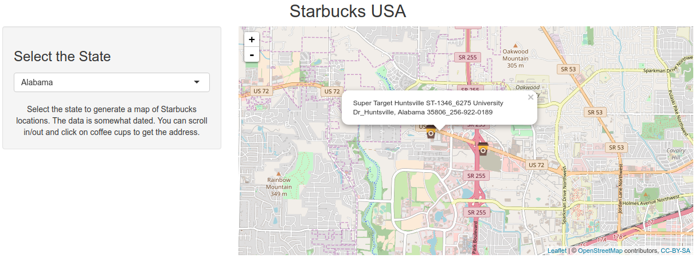

Starbucks USA (Data Products Week 4)
========================================================
author: Gary R Seamans
date: 19 January 2018
autosize: true


Project Description (1)
========================================================
This project is an extension of my previous *Leaflet* projects and uses an older dataset for [Starbucks Locations in the USA](https://gist.github.com/dankohn/09e5446feb4a8faea24f). The dataset was
modified by adding a header row so *Leaflet* would recognize the latitude and longitude columns. The data classes are shown below and the first five rows, are shown on the following slide.


```r
kable(strtable(df))
```


|variable  |class                 |levels  |examples                                                 |
|:---------|:---------------------|:-------|:--------------------------------------------------------|
|longitude |numeric               |NA      |-149.8935557, -149.9054948, -149.7522, -149.8643361, ... |
|latitude  |numeric               |NA      |61.21759217, 61.19533942, 61.2297, 61.19525062, ...      |
|state     |Factor w/ 8902 levels |NA, ... |NA, ...                                                  |
|address   |Factor w/ 8902 levels |NA, ... |NA, ...                                                  |

Project Description (2)
========================================================

```r
kable(head(df,5))
```


| longitude| latitude|state                             |address                                                                                         |
|---------:|--------:|:---------------------------------|:-----------------------------------------------------------------------------------------------|
| -149.8936| 61.21759|Starbucks - AK - Anchorage  00001 |601 West Street_601 West 5th Avenue_Anchorage, Alaska 99501_907-277-2477                        |
| -149.9055| 61.19534|Starbucks - AK - Anchorage  00002 |Carrs-Anchorage #1805_1650 W Northern Lights Blvd_Anchorage, Alaska 99503_907-339-0500          |
| -149.7522| 61.22970|Starbucks - AK - Anchorage  00003 |Elmendorf AFB_Bldg 5800 Westover Avenue_Anchorage, Alaska 99506                                 |
| -149.8643| 61.19525|Starbucks - AK - Anchorage  00004 |Fred Meyer - Anchorage #11_1000 E Northern Lights Blvd_Anchorage, Alaska 995084283_907-264-9600 |
| -149.8380| 61.13751|Starbucks - AK - Anchorage  00005 |Fred Meyer - Anchorage #656_2300 Abbott Road_Anchorage, Alaska 99507_907-365-2000               |

The Shiny App
=========================================================
The Shiny app is hosted at: [Starbucks USA](https://gseamans.shinyapps.io/starbucksusa/) and has the following capabilities:

- Select a state
- Drill down
- Show the address

Using the Map (Select a State)
========================================================
In the left pane select the state to display. Once selected the map will redraw
showing the **Starbucks** locations in that state.




Using the Map (Drill Down)
========================================================
Hovering over one of the circles with a number will highlight the area that contains the **Starbucks**. Clicking on the circle will 
drill down into the area displaying addtional circles or individual **Starbucks** locations (Coffee Cups). As you drill down more map
detail will be visible.




Using the Map (Show the Address)
========================================================

Clicking on one of the coffee cup icons will cause the address, and additional information, for that **Starbucks** to be displayed.



Summary
========================================================

This simple Shiny application is for all of those who are coffee addicts, like myself. It uses a freely available dataset. The *strtable()* function 
used on the second slide was created by Jason Bryer [str Implementation for Data Frames](https://www.r-bloggers.com/str-implementation-for-data-frames/).
